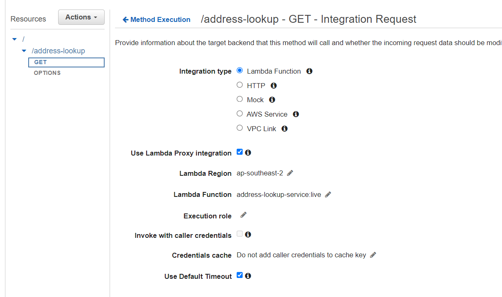

# Address Lookup Service

This service lookups following information for the address in NSW using NSW ARCGIS Rest services  
-suburb name  
-location Cordinates (Longitude and Latidude)  
-State Electoral District Name

## Table of Contents

- [Address Lookup Service](#project-title)
- [Table of Contents](#table-of-contents)
- [About](#about)
- [Getting Started](#getting-started)
  - [Prerequisites](#prerequisites)
  - [Installation](#installation)
- [Usage](#usage)
- [Contributing](#contributing)
- [License](#license)
- [Acknowledgments](#acknowledgments)

## About

Address Lookup service is designed and developed to provide suburb name, state electora district name and location with includes GPS coordinates for the given address. It takes "Address" as query parameters to service url and give json response to the queried address containing

Sample Request URL :  
https://ynfvhoazmf.execute-api.ap-southeast-2.amazonaws.com/dev/address-lookup?address=16-20%20warialda%20street%20kogarah

Here address used in URL is 16-20 Warialda Street Kogarah

Sample Response JSON :  
{  
"suburb": "KOGARAH",  
"location": {  
"longitude": 151.13320558250874,  
"latitude": -33.95710984847756  
},  
"stateElectoralDistrictName": "KOGARAH"  
}

This Service aggregate response from 3 services to get information for generating above output

1. For GPS coordinates : https://portal.spatial.nsw.gov.au/server/rest/services/NSW_Geocoded_Addressing_Theme/FeatureServer/1/query?&outFields=*&f=geojson

2. For Getting Suburb Name: https://portal.spatial.nsw.gov.au/server/rest/services/NSW_Administrative_Boundaries_Theme/FeatureServer/2/query?geometryType=esriGeometryPoint&inSR=4326&spatialRel=esriSpatialRelIntersects&outFields=*&returnGeometry=false&f=geoJSON&geometry=

3. For Getting District Name: https://portal.spatial.nsw.gov.au/server/rest/services/NSW_Administrative_Boundaries_Theme/FeatureServer/4/query?geometryType=esriGeometryPoint&inSR=4326&spatialRel=esriSpatialRelIntersects&outFields=*&returnGeometry=false&f=geoJSON&geometry=

## Getting Started

This service is deployed in AWS Lambda (Serverless) and can be build by running following commands

Instructions for setting up and running your project. Include any prerequisites and installation steps.

### Prerequisites

After cloning this repo in your file system run following steps

1. Install Node version 14 or 16
2. Open project directory in VS-CODE or editor of your choice
3. Create a Lambda function in AWS with name 'address-lookup-service'
4. Configure to run this function on node version 16.
5. Create a api gateway with any name.
6. Create a resource 'address-lookup' with a 'GET' method , enable CORS and integrate the created Lambda function as a proxy.
7. Deploy your API to 'dev' stage. (create new dev stage while deployment is not existing).
8. This should create a url like this which you can use to test your lambda fundtion. https://ynfvhoazmf.execute-api.ap-southeast-2.amazonaws.com/dev
9. Complete url for your deployed application will look like. You can Use this to test your Lambda function in browser window
   https://ynfvhoazmf.execute-api.ap-southeast-2.amazonaws.com/dev/address-lookup
10. (Optional)You can also create alias and then use the alias name with the lambda-function name as 'address-lookup-service:live' where live is alias name pointing to desired version or latest.
    
11. Install AWS CLI and Configure your AWS account in your local dev environment with command "aws configure" and set aws secret key and access keys as default environment. This will help in deployment of lambda function directly by running node command after code modifications.

12. Install Lambda-build globally by running following command. It is required for building, packaging and uploading lambda function to AWS directly using node.  
    "npm i -g lambda-build"

13. Install globally as well with command
    npm i esbuild

List any software, libraries, or tools that users need to install before they can use your project.

### Installation

1. Install 'lambda-build' tool globally by running following command. It is required for building, packaging and uploading lambda function to AWS directly using node.  
   "npm i -g lambda-build"

2. run "npm install" to install all dependencies required for this service to run locally

3. run "npm run deploy" to deploy this service to your AWS account already setup and configured in your system.

Step-by-step instructions on how to install and configure your project. Use code snippets if necessary.

```bash
# Clone the repository
git clone https://github.com/vickyanands/AddressLookupService.git

# Change directory
cd AddressLookupService

# Install dependencies
npm install

# if all setup done correctly then run local to execute sample run of service locally this can also be used for debugging purposes
npm run runLocal

# deploy Lambda function to AWS account(default account as profile is not mentioned)
npm run deploy

# to run unit tests
npm run unit-test

# to run end to end testing execute
npm run e2e-test

# to run all test execute
npm run all-test

# to test run service locally which can also be used for debugging and random testing
npm run local

```

### How To debug this AWS LAMBDA function locally using VSCode

1. Use VSCODE Extension Run and Debug
2. Click on JavaScript Debug Terminal button it will create one terminal
3. click on left side of editor window to enable a debug point on code
4. Just run 'npm run unit-test' or 'npm run local' for simply starting application to run locally for testing and debugging
